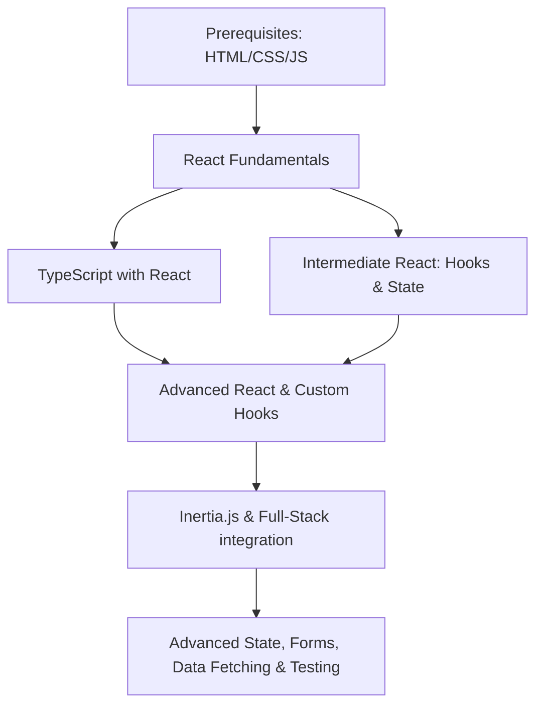

# React & TypeScript Learning Roadmap

Welcome to your React journey! Since your project uses **Laravel + Inertia.js + React + TypeScript + Tailwind CSS**, this roadmap is specifically optimized for this modern, high-performance stack.



---

## 1. Prerequisites (HTML, CSS, JavaScript ES6+)
Before diving deep into React, ensure you have a strong grasp of the underlying technologies. React is "just JavaScript" at its core.

*   **Difficulty:** Beginner
*   **Estimated Time:** 1 to 2 weeks
*   **Key Concepts:**
    *   **Modern CSS:** Flexbox, CSS Grid, custom properties (variables), media queries.
    *   **Arrow Functions:** `const myFn = () => { ... }`
    *   **Array Methods:** `map()`, `filter()`, `reduce()`, `find()`, `includes()`.
    *   **Destructuring & Spread/Rest:** `const { name } = user;` and `[...array, newItem]`.
    *   **Promises & Async/Await:** Fetching data from APIs.
    *   **Modules:** Import/Export syntax.
*   **Code Example (Destructuring & Map):**
    ```javascript
    const users = [{ id: 1, name: 'Alice' }, { id: 2, name: 'Bob' }];
    // Map list to names
    const names = users.map(({ name }) => name); // ['Alice', 'Bob']
    ```
*   **Documentation & Resources:**
    *   [MDN JavaScript Guide](https://developer.mozilla.org/en-US/docs/Web/JavaScript)
    *   [JavaScript.info](https://javascript.info/)

### 📝 Lesson 1 Quiz & Coding Challenge
#### Multiple Choice
1. **What does the `.map()` array method return?**
   * A) The original array modified.
   * B) A new array containing the results of calling the function on every element.
   * C) A single accumulated value.
2. **Given `const user = { id: 1, email: "a@b.com" }`, how do you extract `email` into a variable using destructuring?**
   * A) `const email = user.email;`
   * B) `const { email } = user;`
   * C) `const [ email ] = user;`

#### 💻 Coding Challenge
Complete the function `getActiveUsers(users)` using arrow functions and the `.filter()` method to return only users where `isActive` is `true`.
```javascript
const usersList = [
    { id: 1, name: "Alice", isActive: true },
    { id: 2, name: "Bob", isActive: false },
    { id: 3, name: "Charlie", isActive: true }
];

// Write your function here:
const getActiveUsers = (users) => {
    // Fill in code
};
```

<details>
<summary>🔍 Click to view answers & solution</summary>

**Multiple Choice Answers:**
1. **B** — `.map()` always returns a new array and does not modify the original array.
2. **B** — Object destructuring uses curly braces `{}` matching the property names.

**Coding Challenge Solution:**
```javascript
const getActiveUsers = (users) => {
    return users.filter(user => user.isActive === true);
    // Or shorter: return users.filter(user => user.isActive);
};
```
</details>

---

## 2. React Fundamentals
Learn how React builds user interfaces using components, properties (Props), and local state.

*   **Difficulty:** Beginner
*   **Estimated Time:** 2 weeks
*   **Key Concepts:**
    *   **JSX (JavaScript XML):** Writing HTML-like structures inside JavaScript.
    *   **Functional Components:** Building reusable blocks of UI.
    *   **Props:** Passing data down to child components (read-only).
    *   **State (`useState`):** Managing local component memory that changes over time.
    *   **Lists & Keys:** Rendering arrays using `.map()` and providing a unique `key` prop.
    *   **Event Handling:** Responding to user interactions (e.g., `onClick`, `onChange`).
*   **Code Example (Basic Component):**
    ```tsx
    import { useState } from 'react';

    interface ButtonProps {
        label: string;
    }

    export function CounterButton({ label }: ButtonProps) {
        const [count, setCount] = useState<number>(0);

        return (
            <button 
                onClick={() => setCount(count + 1)}
                className="px-4 py-2 bg-blue-500 text-white rounded"
            >
                {label}: {count}
            </button>
        );
    }
    ```
*   **Documentation & Resources:**
    *   [React Dev Quick Start](https://react.dev/learn)

> [!IMPORTANT]
> Always provide a unique and stable `key` prop (like an ID from a database) when rendering list items. Avoid using the array index as a key if the order of elements can change.

### 📝 Lesson 2 Quiz & Coding Challenge
#### Multiple Choice
1. **Can a component directly modify its own `props`?**
   * A) Yes, props are read-write.
   * B) No, props are read-only; if data needs to change, use `state`.
2. **What happens to a component when its state updates?**
   * A) The browser does a full-page reload.
   * B) The component re-renders (executes its function again) with the new state.
   * C) Nothing, unless we manually call refresh.

#### 💻 Coding Challenge
Create a functional component named `UserProfile` that accepts two props, `name` and `email`, and renders them inside a `div` element.
```jsx
// Write your UserProfile component here:

```

<details>
<summary>🔍 Click to view answers & solution</summary>

**Multiple Choice Answers:**
1. **B** — Props are immutable (read-only) inputs from parent to child.
2. **B** — React triggers a re-render automatically when state changes so the UI stays in sync.

**Coding Challenge Solution:**
```jsx
export function UserProfile(props) {
    return (
        <div>
            <h2>Name: {props.name}</h2>
            <p>Email: {props.email}</p>
        </div>
    );
}

// Or with destructuring:
export function UserProfile({ name, email }) {
    return (
        <div>
            <h2>Name: {name}</h2>
            <p>Email: {email}</p>
        </div>
    );
}
```
</details>

---

## 3. TypeScript with React
Since your workspace uses TypeScript, integrating it early will save you hours of debugging. TypeScript ensures that props, state, and event parameters are correctly typed.

*   **Difficulty:** Intermediate
*   **Estimated Time:** 1 week
*   **Key Concepts:**
    *   **Component Props:** Defining `interface` or `type` for props.
    *   **Event Handlers:** Typing events like `React.ChangeEvent<HTMLInputElement>` or `React.FormEvent`.
    *   **Generics with hooks:** Typing `useState<User | null>(null)`.
    *   **Strict Mode & Nullable types:** Dealing with optional fields like `description?: string`.
*   **Code Example (Typed Input Component):**
    ```tsx
    import React from 'react';

    interface InputProps {
        label: string;
        value: string;
        onChange: (value: string) => void;
    }

    export function TextInput({ label, value, onChange }: InputProps) {
        const handleChange = (e: React.ChangeEvent<HTMLInputElement>) => {
            onChange(e.target.value);
        };

        return (
            <div>
                <label className="block text-sm font-medium">{label}</label>
                <input 
                    type="text" 
                    value={value} 
                    onChange={handleChange} 
                    className="border p-2 rounded w-full"
                />
            </div>
        );
    }
    ```
*   **Documentation & Resources:**
    *   [TypeScript React Cheat Sheet](https://react-typescript-cheatsheet.netlify.app/)

### 📝 Lesson 3 Quiz & Coding Challenge
#### Multiple Choice
1. **How do you type a parameter for a form submit handler function in React?**
   * A) `e: Event`
   * B) `e: React.FormEvent`
   * C) `e: React.SubmitEvent`
2. **How do you define a state variable that starts as `null` but will eventually contain a `Task` object?**
   * A) `const [task, setTask] = useState<Task | null>(null);`
   * B) `const [task, setTask] = useState(null) as Task;`
   * C) `const [task, setTask] = useState<Task>(null);`

#### 💻 Coding Challenge
Add TypeScript types to the props and state of the following component. The prop `title` is a string, and the local state variable `isOpen` is a boolean.
```tsx
import { useState } from 'react';

// 1. Define your Prop interface here:


export function CollapsibleSection({ title }) {
    // 2. Add type parameters to the useState hook if needed:
    const [isOpen, setIsOpen] = useState(false);

    return (
        <div>
            <button onClick={() => setIsOpen(!isOpen)}>{title}</button>
            {isOpen && <div>Content details...</div>}
        </div>
    );
}
```

<details>
<summary>🔍 Click to view answers & solution</summary>

**Multiple Choice Answers:**
1. **B** — `React.FormEvent` (or `React.FormEvent<HTMLFormElement>`) is the standard React synthetic event type for form submissions.
2. **A** — `useState<Task | null>(null)` uses TypeScript generics to tell React the state can hold either a `Task` structure or `null`.

**Coding Challenge Solution:**
```tsx
import { useState } from 'react';

// 1. Define interface
interface CollapsibleSectionProps {
    title: string;
}

export function CollapsibleSection({ title }: CollapsibleSectionProps) {
    // 2. Type is inferred as boolean from the initial value (false),
    // but you can write it explicitly too: useState<boolean>(false)
    const [isOpen, setIsOpen] = useState<boolean>(false);

    return (
        <div>
            <button onClick={() => setIsOpen(!isOpen)}>{title}</button>
            {isOpen && <div>Content details...</div>}
        </div>
    );
}
```
</details>

---

## 4. Intermediate React & Hooks
Hooks let you use React features (like state and lifecycle events) inside functional components.

*   **Difficulty:** Intermediate
*   **Estimated Time:** 2 weeks
*   **Key Concepts:**
    *   **`useState`:** For simple local state.
    *   **`useEffect`:** For side effects (fetching data, synchronization, subscriptions). Understanding the dependency array.
    *   **`useRef`:** Accessing DOM elements directly and keeping values across renders without re-rendering.
    *   **`useContext`:** Sharing global values (like theme or user info) without prop drilling.
    *   **`useMemo` & `useCallback`:** Performance optimization hooks for caching values or function references.
    *   **Lifting State Up:** Moving state to the closest common parent when components need to share data.
*   **Code Example (useEffect dependency array):**
    ```tsx
    import { useState, useEffect } from 'react';

    export function SearchComponent() {
        const [query, setQuery] = useState('');
        const [results, setResults] = useState<string[]>([]);

        useEffect(() => {
            if (!query) return;
            
            let isCurrent = true;
            fetch(`/api/search?q=${query}`)
                .then(res => res.json())
                .then(data => {
                    if (isCurrent) setResults(data);
                });

            // Cleanup function to prevent race conditions
            return () => {
                isCurrent = false;
            };
        }, [query]); // Runs whenever 'query' changes

        return (
            <input value={query} onChange={(e) => setQuery(e.target.value)} />
        );
    }
    ```
*   **Documentation & Resources:**
    *   [Built-in React Hooks Reference](https://react.dev/reference/react)

### 📝 Lesson 4 Quiz & Coding Challenge
#### Multiple Choice
1. **If a `useEffect` has an empty dependency array `[]`, when does it run?**
   * A) On every single render of the component.
   * B) Only once, right after the component mounts.
   * C) Only when the component unmounts.
2. **What hook should you use if you want to store a mutable value that does *not* cause a re-render when changed?**
   * A) `useState`
   * B) `useMemo`
   * C) `useRef`

#### 💻 Coding Challenge
Fill in the `useEffect` hook below so that the browser tab title (`document.title`) updates to match the pattern `"Clicks: {count}"` every time the `count` state updates.
```tsx
import { useState, useEffect } from 'react';

export function PageTitleCounter() {
    const [count, setCount] = useState<number>(0);

    // Complete the useEffect hook here:
    useEffect(() => {
        
    }, []); // Fix the dependencies too!

    return (
        <button onClick={() => setCount(count + 1)}>
            Increment Count ({count})
        </button>
    );
}
```

<details>
<summary>🔍 Click to view answers & solution</summary>

**Multiple Choice Answers:**
1. **B** — An empty dependency array tells React the effect does not depend on any state/props, so it only runs once after the initial render.
2. **C** — `useRef` returns a mutable ref object whose `.current` property can hold any value, and updating it does not trigger a component re-render.

**Coding Challenge Solution:**
```tsx
useEffect(() => {
    document.title = `Clicks: ${count}`;
}, [count]); // Make sure count is in the dependency array!
```
</details>

---

## 5. Routing: Inertia.js vs React Router
Since you are using Laravel, you don't need a client-side library like React Router! **Inertia.js** handles routing on the server and pushes components to the frontend.

| Routing Solution | Architecture | Use Case |
| :--- | :--- | :--- |
| **Inertia.js Link / router** | Server-driven routing. Laravel decides which page to render. | Full-stack Laravel + React apps. |
| **React Router** | Client-side routing. React controls URL and renders components without page refresh. | Single Page Applications (SPAs) with independent APIs. |

*   **Difficulty:** Intermediate
*   **Estimated Time:** 3 days
*   **Key Concepts (Inertia.js Routing):**
    *   `<Link href="/path">` component for seamless transitions.
    *   Using the `router` object: `router.post()`, `router.put()`, `router.delete()`.
    *   Handling Page visits and tracking navigation state.
*   **Code Example (Inertia Link & Navigation):**
    ```tsx
    import { Link, router } from '@inertiajs/react';

    export function Navigation() {
        const handleLogout = () => {
            router.post('/logout');
        };

        return (
            <nav className="flex gap-4">
                <Link href="/dashboard" className="text-blue-500 hover:underline">Dashboard</Link>
                <button onClick={handleLogout} className="text-red-500 hover:underline">Logout</button>
            </nav>
        );
    }
    ```
*   **Documentation & Resources:**
    *   [Inertia.js Pages & Routing Documentation](https://inertiajs.com/pages)

### 📝 Lesson 5 Quiz & Coding Challenge
#### Multiple Choice
1. **When using Inertia.js, how does the frontend navigate to a new page without doing a full browser reload?**
   * A) By using the standard HTML `<a>` tag.
   * B) By using Inertia's `<Link>` component.
   * C) By writing custom `window.location` handlers.
2. **How would you programmatically send a DELETE request to `/tasks/5` inside an event handler?**
   * A) `router.delete('/tasks/5')`
   * B) `fetch('/tasks/5', { method: 'DELETE' })`
   * C) `Link.delete('/tasks/5')`

#### 💻 Coding Challenge
Write a small navigation bar component using Inertia's `<Link>` that redirects the user to `/dashboard` and `/profile`. Add a Tailwind class to make them look like buttons.
```tsx
import { Link } from '@inertiajs/react';

export function NavigationButtons() {
    return (
        <div className="flex gap-2">
            {/* Create two Link components here */}
        </div>
    );
}
```

<details>
<summary>🔍 Click to view answers & solution</summary>

**Multiple Choice Answers:**
1. **B** — Inertia's `<Link>` component intercepts the click and performs an AJAX visit, keeping the page single-page.
2. **A** — Inertia's `router` object provides programmatic methods like `router.get()`, `router.post()`, `router.put()`, and `router.delete()` to communicate with Laravel.

**Coding Challenge Solution:**
```tsx
import { Link } from '@inertiajs/react';

export function NavigationButtons() {
    return (
        <div className="flex gap-2">
            <Link href="/dashboard" className="px-3 py-1.5 bg-zinc-900 text-white rounded text-sm">
                Dashboard
            </Link>
            <Link href="/profile" className="px-3 py-1.5 border border-zinc-200 rounded text-sm">
                Profile
            </Link>
        </div>
    );
}
```
</details>

---

## 6. Styling: Tailwind CSS in React
Tailwind is preconfigured in your starter kit. You'll want to learn React-specific design patterns.

*   **Difficulty:** Beginner to Intermediate
*   **Estimated Time:** 3 days
*   **Key Concepts:**
    *   **Utility classes:** Styling dynamically using template literals or helpers.
    *   **Class Merger Utility (`cn`):** Combining Tailwind classes conditionally.
    *   **Responsive and Dark variants:** `dark:bg-zinc-950 md:flex-row`.
*   **Code Example (Conditional Styling):**
    ```tsx
    import { cn } from '@/lib/utils'; // Included in your shadcn/ui starter kit

    interface AlertProps {
        variant: 'info' | 'error';
        message: string;
    }

    export function Alert({ variant, message }: AlertProps) {
        return (
            <div className={cn(
                "p-4 rounded-md border",
                variant === 'info' && "bg-blue-50 border-blue-200 text-blue-800 dark:bg-blue-900/20",
                variant === 'error' && "bg-red-50 border-red-200 text-red-800 dark:bg-red-900/20"
            )}>
                {message}
            </div>
        );
    }
    ```

### 📝 Lesson 6 Quiz & Coding Challenge
#### Multiple Choice
1. **What is the purpose of the `cn()` helper function commonly found in shadcn/ui setups?**
   * A) It connects the database to the component.
   * B) It compiles CSS during build time.
   * C) It merges class names and correctly resolves Tailwind class conflicts.
2. **How does Tailwind apply styling for dark mode?**
   * A) By using class prefixes like `dark:text-white`.
   * B) By writing css stylesheets for dark mode.
   * C) By creating a separate component.

#### 💻 Coding Challenge
Create a dynamic status badge component `StatusBadge` that accepts a `status` prop (`"active" | "inactive"`). Use the template literal or `cn` helper so the badge has green text/bg if `"active"`, and grey text/bg if `"inactive"`.
```tsx
import { cn } from '@/lib/utils';

interface BadgeProps {
    status: 'active' | 'inactive';
}

export function StatusBadge({ status }: BadgeProps) {
    return (
        <span className={cn(
            "px-2.5 py-0.5 text-xs font-semibold rounded-full border",
            // Add your conditional class logic here:
            
        )}>
            {status}
        </span>
    );
}
```

<details>
<summary>🔍 Click to view answers & solution</summary>

**Multiple Choice Answers:**
1. **C** — The `cn` utility combines `clsx` and `tailwind-merge` to combine conditional strings and resolve conflicting classes (e.g. `p-4 p-2` becomes `p-2`).
2. **A** — Tailwind uses the `dark:` variant modifier which applies styles depending on whether the `.dark` class is present on a parent element (like `<html>` or `<body>`).

**Coding Challenge Solution:**
```tsx
export function StatusBadge({ status }: BadgeProps) {
    return (
        <span className={cn(
            "px-2.5 py-0.5 text-xs font-semibold rounded-full border",
            status === 'active' && "bg-emerald-500/10 text-emerald-600 border-emerald-500/20",
            status === 'inactive' && "bg-slate-500/10 text-slate-600 border-slate-500/20"
        )}>
            {status}
        </span>
    );
}
```
</details>

---

## 7. Forms, Validation & Data Flow
Forms are critical in full-stack apps. Learn how to bind form values to state and validate them.

*   **Difficulty:** Intermediate
*   **Estimated Time:** 1 week
*   **Key Concepts:**
    *   **Controlled Inputs:** Binding input `value` to state and updates to `onChange`.
    *   **Uncontrolled Inputs:** Using `useRef` to fetch DOM inputs when needed.
    *   **Validation:** Handling validation errors returned from Laravel or validated client-side with Zod/Yup.
    *   **Inertia's `useForm`:** Perfect for submitting to Laravel backends with error mapping.
*   **Code Example (Inertia Forms):**
    ```tsx
    import { useForm } from '@inertiajs/react';

    export function CreateProjectForm() {
        const { data, setData, post, processing, errors } = useForm({
            name: '',
            description: ''
        });

        const handleSubmit = (e: React.FormEvent) => {
            e.preventDefault();
            post('/projects');
        };

        return (
            <form onSubmit={handleSubmit} className="space-y-4">
                <input 
                    value={data.name} 
                    onChange={e => setData('name', e.target.value)} 
                    placeholder="Project Name" 
                />
                {errors.name && <p className="text-red-500">{errors.name}</p>}
                
                <button type="submit" disabled={processing}>Save</button>
            </form>
        );
    }
    ```
*   **Documentation & Resources:**
    *   [Inertia.js Forms](https://inertiajs.com/forms)

### 📝 Lesson 7 Quiz & Coding Challenge
#### Multiple Choice
1. **What is a "controlled input" in React?**
   * A) An input element managed by the browser's default DOM state.
   * B) An input element whose value is driven by React component state.
   * C) A disabled input.
2. **In the Inertia `useForm` hook, how are validation errors from Laravel mapped?**
   * A) They are output to the developer console automatically.
   * B) They are populated into the `errors` object by matching form keys.
   * C) They trigger a javascript alert.

#### 💻 Coding Challenge
Create a basic form with two controlled text inputs (`username` and `bio`) using basic React `useState` state. Create a submit handler that calls `console.log(username, bio)` and prevents the default page refresh.
```tsx
import { useState, FormEvent } from 'react';

export function ProfileForm() {
    const [username, setUsername] = useState('');
    const [bio, setBio] = useState('');

    const handleSubmit = (e: FormEvent) => {
        // Prevent refresh and log variables:
        
    };

    return (
        <form onSubmit={handleSubmit} className="space-y-4">
            {/* Build your two input elements here */}
            
            <button type="submit">Submit</button>
        </form>
    );
}
```

<details>
<summary>🔍 Click to view answers & solution</summary>

**Multiple Choice Answers:**
1. **B** — Controlled inputs use `value` and `onChange` hooks to keep the form state strictly in React.
2. **B** — Laravel's validator returns a JSON error response, and Inertia automatically parses and injects these validation messages into the component's form `errors` object.

**Coding Challenge Solution:**
```tsx
import { useState, FormEvent } from 'react';

export function ProfileForm() {
    const [username, setUsername] = useState('');
    const [bio, setBio] = useState('');

    const handleSubmit = (e: FormEvent) => {
        e.preventDefault();
        console.log(username, bio);
    };

    return (
        <form onSubmit={handleSubmit} className="space-y-4 flex flex-col max-w-xs">
            <input 
                type="text" 
                value={username} 
                onChange={(e) => setUsername(e.target.value)} 
                placeholder="Username" 
                className="border p-2"
            />
            <input 
                type="text" 
                value={bio} 
                onChange={(e) => setBio(e.target.value)} 
                placeholder="Bio" 
                className="border p-2"
            />
            <button type="submit" className="bg-blue-500 text-white py-1">Submit</button>
        </form>
    );
}
```
</details>

---

## 8. Advanced React & Performance
As your app grows, you need to write clean, performant React code.

*   **Difficulty:** Advanced
*   **Estimated Time:** 2 weeks
*   **Key Concepts:**
    *   **Custom Hooks:** Abstracting component logic into reusable functions (e.g. `useLocalStorage`, `useDebounce`).
    *   **Error Boundaries:** Catching JavaScript errors in components to prevent the whole app from crashing.
    *   **Suspense & Lazy Loading:** Code splitting components so they load only when needed.
    *   **React.memo:** Preventing unnecessary re-renders of child components whose props haven't changed.
*   **Code Example (Custom Hook for Window Size):**
    ```tsx
    import { useState, useEffect } from 'react';

    export function useWindowWidth() {
        const [width, setWidth] = useState(window.innerWidth);

        useEffect(() => {
            const handleResize = () => setWidth(window.innerWidth);
            window.addEventListener('resize', handleResize);
            return () => window.removeEventListener('resize', handleResize);
        }, []);

        return width;
    }
    ```

### 📝 Lesson 8 Quiz & Coding Challenge
#### Multiple Choice
1. **Custom hooks in React must always start with what prefix?**
   * A) `get`
   * B) `use`
   * C) `handle`
2. **When should you wrap a component in `React.memo`?**
   * A) When it renders very frequently with identical props, to skip re-rendering.
   * B) Always, because optimization is always good.
   * C) When it uses database requests.

#### 💻 Coding Challenge
Create a custom hook called `useToggle` that accepts an optional initial boolean value (defaulting to `false`) and returns a tuple containing:
1. The current boolean state value.
2. A function that toggles the boolean value to its opposite.
```tsx
import { useState } from 'react';

// Write your custom hook here:
export function useToggle(initialValue: boolean = false) {

}
```

<details>
<summary>🔍 Click to view answers & solution</summary>

**Multiple Choice Answers:**
1. **B** — React rules mandate that custom hooks must start with the prefix `use` (e.g., `useAuth`, `useForm`) so build tools can enforce hook rules.
2. **A** — Optimization has overhead. Wrap component with `React.memo` only when it is verified to render frequently with unchanged props.

**Coding Challenge Solution:**
```tsx
import { useState } from 'react';

export function useToggle(initialValue: boolean = false) {
    const [state, setState] = useState<boolean>(initialValue);

    const toggle = () => {
        setState((current) => !current);
    };

    return [state, toggle] as const;
}
```
</details>

---

## 9. State Management: Context API vs Zustand
State management becomes necessary when many components need access to the same state (e.g., shopping cart, workspace settings).

*   **Difficulty:** Intermediate to Advanced
*   **Estimated Time:** 1 week
*   **Key Concepts:**
    *   **Context API:** Built-in React tool for simple, low-frequency state updates.
    *   **Zustand:** Ultra-simple, fast external store that is great for global state.
    *   **Redux Toolkit:** Traditional, feature-rich but requires boilerplate. Avoid for smaller projects.
*   **Code Example (Simple Zustand Store):**
    ```typescript
    import { create } from 'zustand';

    interface SettingsState {
        theme: 'light' | 'dark';
        toggleTheme: () => void;
    }

    export const useSettingsStore = create<SettingsState>((set) => ({
        theme: 'light',
        toggleTheme: () => set((state) => ({ 
            theme: state.theme === 'light' ? 'dark' : 'light' 
        })),
    }));
    ```
*   **Documentation & Resources:**
    *   [Zustand Docs](https://zustand-demo.pmnd.rs/)

### 📝 Lesson 9 Quiz & Coding Challenge
#### Multiple Choice
1. **Which state tool is built directly into React without requiring extra npm packages?**
   * A) Zustand
   * B) Redux Toolkit
   * C) Context API
2. **Why is Zustand often preferred over the Context API for active global state updates?**
   * A) It has no provider wrapper requirements and avoids rendering entire component sub-trees on every update.
   * B) It is written by the core React team.
   * C) It runs on the database server.

#### 💻 Coding Challenge
Create a basic Zustand store using TypeScript. The store should have a number state `count` and two functions: `increment` and `decrement`.
```typescript
import { create } from 'zustand';

interface CounterState {
    count: number;
    increment: () => void;
    decrement: () => void;
}

// Write the Zustand store here:
export const useCounterStore = create<CounterState>((set) => ({

}));
```

<details>
<summary>🔍 Click to view answers & solution</summary>

**Multiple Choice Answers:**
1. **C** — Context API is native to React (`React.createContext`, `useContext`).
2. **A** — Zustand lets components subscribe to precise slices of state, preventing unnecessary renders. It also requires much less setup boilerplate.

**Coding Challenge Solution:**
```typescript
import { create } from 'zustand';

interface CounterState {
    count: number;
    increment: () => void;
    decrement: () => void;
}

export const useCounterStore = create<CounterState>((set) => ({
    count: 0,
    increment: () => set((state) => ({ count: state.count + 1 })),
    decrement: () => set((state) => ({ count: state.count - 1 })),
}));
```
</details>

---

## 10. Core Full-Stack Concepts: Inertia.js
Since you are using Inertia, you don't need independent APIs (REST/GraphQL) or token-based auth systems (JWT) to build your app. Inertia shares state via standard Laravel controllers.

*   **Difficulty:** Intermediate
*   **Estimated Time:** 1 week
*   **Key Concepts:**
    *   **Shared Props:** Setting up globally shared data (e.g. current authenticated user) in Laravel `HandleInertiaRequests` middleware.
    *   **Persistent Layouts:** Preserving state across page navigation (such as sidebar state, scroll position).
    *   **SSR (Server-Side Rendering):** Configuring Laravel and Vite to render the initial React tree on the server for SEO.
*   **Code Example (Accessing Shared Data in React):**
    ```tsx
    import { usePage } from '@inertiajs/react';
    import { SharedData } from '@/types'; // Custom TS type in your project

    export function UserProfileHeader() {
        // usePage gives you access to data shared from Laravel
        const { auth } = usePage<SharedData>().props;

        return (
            <div>Welcome back, {auth.user.name}!</div>
        );
    }
    ```

### 📝 Lesson 10 Quiz & Coding Challenge
#### Multiple Choice
1. **Where do you register global data (like the logged-in user details) that you want to access from any React page?**
   * A) Directly in `app.tsx`
   * B) In Laravel's `HandleInertiaRequests` middleware (within `share` method).
   * C) In the database schema.
2. **What does the `usePage()` hook from Inertia provide?**
   * A) Navigation controls.
   * B) Browser history controls.
   * C) Access to the current Inertia page's props, errors, and shared data.

#### 💻 Coding Challenge
Create a React component called `FlashMessage` that uses the Inertia `usePage` hook to grab the flash message values passed down from Laravel (e.g., `flash.success`) and renders it if it exists. Assume the shared data is typed with an object containing `{ flash: { success: string | null } }`.
```tsx
import { usePage } from '@inertiajs/react';

export function FlashMessage() {
    // 1. Get access to shared props:
    
    // 2. Render only if flash.success exists:
    return (
        null
    );
}
```

<details>
<summary>🔍 Click to view answers & solution</summary>

**Multiple Choice Answers:**
1. **B** — Inertia's `HandleInertiaRequests` middleware is where you push data to the shared payload.
2. **C** — `usePage()` provides context-level data, which is useful for pulling global props, authenticated user parameters, and flash messages.

**Coding Challenge Solution:**
```tsx
import { usePage } from '@inertiajs/react';

interface SharedProps {
    flash: {
        success: string | null;
    };
    [key: string]: unknown;
}

export function FlashMessage() {
    const { props } = usePage<SharedProps>();
    const successMessage = props.flash.success;

    if (!successMessage) {
        return null;
    }

    return (
        <div className="p-3 bg-emerald-500/10 text-emerald-600 border border-emerald-500/20 rounded">
            {successMessage}
        </div>
    );
}
```
</details>

---

## 11. Practice Projects (Step-by-Step)

The best way to learn React is to build. Build these progressive projects in your workspace or separate repos:

### Project 1: Dynamic Todo List (Frontend-Only)
*   **Goal:** Learn components, lists, keys, conditional styles, and forms.
*   **Spec:** Simple interface to add, toggle completed status, delete, and filter (all, pending, completed) tasks.

### Project 2: Tasks Manager with database (Full-Stack CRUD)
*   **Goal:** Learn Laravel Controller validation + Inertia interaction + React Modals.
*   **Spec:** *Already built for you!* Walk through [walkthrough.md](file:///c:/Users/ian/learning_react/walkthrough.md) and [tasks/index.tsx](file:///c:/Users/ian/learning_react/resources/js/pages/tasks/index.tsx) to see how database records map to React UI.

### Project 3: Real-Time Kanban Board (Full-Stack)
*   **Goal:** Drag-and-drop state, multiple lists, and saving arrangements.
*   **Spec:** Build a drag-and-drop Kanban interface where tasks can be moved between columns (Todo, In Progress, Done) and updates are persisted to the database.

---

## 12. Curated React Learning Resources

> [!TIP]
> Do not try to learn everything at once. Read the official React documentation first, write code, run into problems, and refer to specific tutorials.

*   **Official Documentation (Must Read):**
    *   [React.dev - Start Here](https://react.dev/) — The updated, functional-component-focused official guide.
    *   [TypeScript handbook](https://www.typescriptlang.org/docs/)
*   **Recommended Video Tutorials:**
    *   *Academind* or *Net Ninja* on YouTube (search React & TypeScript guides).
    *   *Laracasts* (Specifically their **Inertia & React** series).
*   **Tools:**
    *   [React Developer Tools (Chrome Extension)](https://chromewebstore.google.com/detail/react-developer-tools/fmkadmapgofadopljbjfomgajcojhmha) — Allows you to inspect state, props, and component re-renders directly in your browser.
